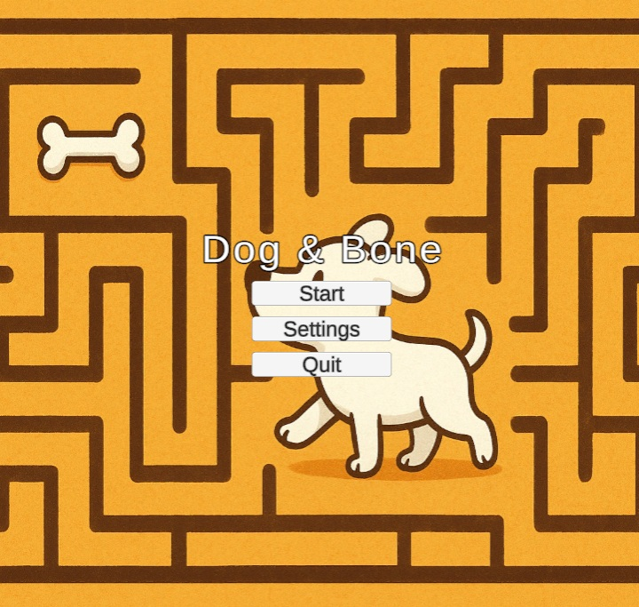
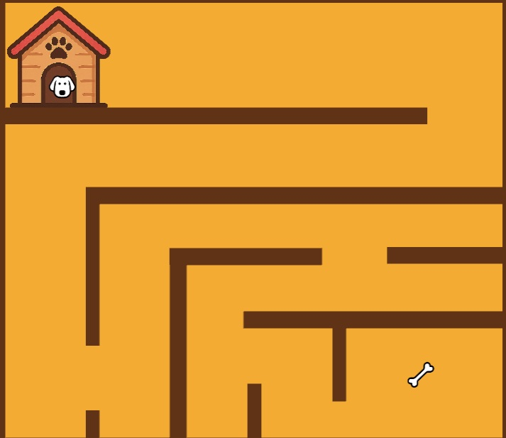

# DogAndBone
Dog And Bone Maze Game

Game Description
Dog & Bone is a simple Unity maze-style game where you guide a dog with your mouse to reach the bone without touching the walls. If you touch a wall the Game Over. If you reach the bone, You Win!

How to Play
•   Use your mouse to move the Dog.
•   Don’t touch the walls or the game ends.
•   Reach the bone to win.
•   From the Main Menu, you can:
o   Start the game
o   Go to settings and adjust game volume
o   Exit the game

Features
•   Start menu with Play, Settings and Quit buttons
•   "Game Over" popup with Try Again or Main Menu buttons
•   "You Win!" popup with Play Again or Main Menu buttons
•   Background ambience sounds
•   Sound effects for winning

Installation
1.  Clone or download this repository.
2.  Open the project in Unity (version 2022.3.44f1 or newer).
3.  Open the Main Menu scene and press Play.

Project Structure
•   Scenes/ → Main Menu, Game
•   Scripts/ → DogController, GameManager, Dogbounds, MenuContainer etc.
•   Audio/ → Ambience sound, Goal sound

Bugs
•   The volume slider still has a problem and it does not work properly

Author
Created by Mikko Ylönen
